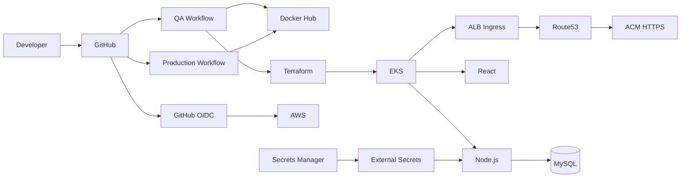

# 🚀 Production-Ready 3-Tier Application Deployment on AWS EKS

<p align="center">


</p>

## 📖 Project Overview

This project demonstrates a complete **enterprise-grade DevOps implementation** for deploying a modern **3-Tier Web Application** on **Amazon EKS**.

The infrastructure is fully automated using **Terraform**, authentication from GitHub to AWS is implemented using **GitHub OIDC**, and deployments are automated through separate **QA** and **Production** GitHub Actions pipelines.

A custom domain was purchased and integrated with **Amazon Route 53**, while **AWS Certificate Manager (ACM)** provides SSL/TLS certificates for secure HTTPS access.

---

# ✨ Key Features

- Infrastructure fully provisioned using Terraform
- GitHub OIDC authentication (No AWS access keys)
- Separate QA and Production environments
- Independent QA & Production GitHub Actions pipelines
- Dockerized React + Node.js application
- Amazon EKS deployment
- MySQL StatefulSet
- AWS Secrets Manager + External Secrets Operator
- AWS Load Balancer Controller
- Route53 custom domain
- HTTPS using ACM
- Kubernetes Ingress

---

# 🏗 Architecture

| Layer | Technology |
|------|------------|
| Source Control | GitHub |
| Authentication | GitHub OIDC |
| CI/CD | GitHub Actions |
| Infrastructure | Terraform |
| Containers | Docker |
| Registry | Docker Hub |
| Kubernetes | Amazon EKS |
| Ingress | AWS Load Balancer Controller |
| DNS | Amazon Route53 |
| SSL | AWS Certificate Manager |
| Secrets | AWS Secrets Manager + External Secrets |
| Database | MySQL StatefulSet |
| Frontend | React |
| Backend | Node.js |



# ☁ Infrastructure Provisioned using Terraform

- VPC & Networking
- Amazon EKS Cluster
- Managed Node Group
- IAM Roles
- GitHub OIDC Provider
- IAM Role for GitHub Actions
- IAM Role for AWS Load Balancer Controller
- IAM Role for External Secrets (IRSA)
- AWS Secrets Manager resources
- Security Groups

# 🔄 QA → Production CI/CD Flow

1. Developer pushes code to **QA** branch.
2. QA GitHub Actions pipeline builds Docker images.
3. Images are pushed to Docker Hub.
4. Kubernetes manifests are updated and deployed to the QA namespace.
5. Application is validated in QA.
6. Code is merged into the production branch.
7. Production pipeline promotes the approved image and deploys it to Production.
8. Rollout status is verified automatically.

# 🌐 Custom Domain & HTTPS

- Purchased a custom domain.
- Configured Amazon Route53 Hosted Zone.
- Requested and validated ACM certificate.
- Configured AWS ALB Ingress.
- Enabled secure HTTPS access.

# 📷 Project Walkthrough

Create `assets/images/` and place screenshots in this order:

1. Repository Structure
2. Terraform Apply
3. GitHub OIDC Configuration
4. EKS Cluster
5. Docker Images
6. QA Pipeline Success
7. QA Application
8. AWS Secrets Manager
9. External Secrets
10. MySQL StatefulSet
11. ALB Ingress
12. Route53 Hosted Zone
13. ACM Certificate
14. Production Pipeline
15. Production Application
16. HTTPS Working

Example:

```md
## Step 1 - Repository Structure


## Step 2 - Terraform Deployment

```

# 📁 Repository Structure

```text
client/
server/
kubernetes/
terraform/
.github/workflows/
```

# 🚀 Future Enhancements

- ArgoCD GitOps
- Blue/Green Deployment
- Canary Deployment
- Prometheus & Grafana
- Loki
- Tempo
- Horizontal Pod Autoscaler

# 👨‍💻 Author

**Mayank Fulzele**

If you found this project useful, consider giving it a ⭐.
