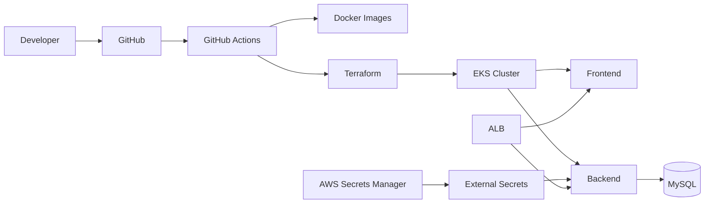

# 🚀 3-Tier Application Deployment on AWS EKS

## 📖 Overview
This project demonstrates a production-style **3-tier application** deployed on **Amazon EKS** using Infrastructure as Code and modern DevOps practices.

### ✨ Features
- React frontend
- Node.js backend
- MySQL StatefulSet
- Amazon EKS
- Terraform provisioning
- GitHub Actions CI/CD
- QA and Production environments
- AWS Load Balancer Controller (ALB)
- External Secrets Operator with AWS Secrets Manager
- Kubernetes Ingress and Services

## 🏗️ Architecture

## 🛠 Tech Stack
| Layer | Technology |
|---|---|
|Frontend|React|
|Backend|Node.js|
|Database|MySQL|
|Containers|Docker|
|Orchestration|Kubernetes (EKS)|
|IaC|Terraform|
|CI/CD|GitHub Actions|
|Secrets|AWS Secrets Manager + External Secrets|
|Ingress|AWS ALB|

## 📂 Repository Structure (partial)

- `3-tier-project-main/`
- `3-tier-project-main/.github/`
- `3-tier-project-main/.github/workflows/`
- `3-tier-project-main/.github/workflows/prod-cicd.yml`
- `3-tier-project-main/.github/workflows/qa-cicd.yml`
- `3-tier-project-main/.gitignore`
- `3-tier-project-main/K8-manifest/`
- `3-tier-project-main/K8-manifest/app-deploy.yml`
- `3-tier-project-main/K8-manifest/app-svc.yml`
- `3-tier-project-main/K8-manifest/ingress.yml`
- `3-tier-project-main/K8-manifest/prod/`
- `3-tier-project-main/K8-manifest/prod/app-deployment.yaml`
- `3-tier-project-main/K8-manifest/prod/app-ingress.yaml`
- `3-tier-project-main/K8-manifest/prod/app-svc.yaml`
- `3-tier-project-main/MYSQL-PROD-Yaml-Manifest/`
- `3-tier-project-main/MYSQL-PROD-Yaml-Manifest/external_secret.yml`
- `3-tier-project-main/MYSQL-PROD-Yaml-Manifest/secretstore.yml`
- `3-tier-project-main/MYSQL-PROD-Yaml-Manifest/statefulset.yml`
- `3-tier-project-main/MYSQL-PROD-Yaml-Manifest/svc.yml`
- `3-tier-project-main/MYSQL-QA-Yaml-Manifestts/`
- `3-tier-project-main/MYSQL-QA-Yaml-Manifestts/external-secret.yaml`
- `3-tier-project-main/MYSQL-QA-Yaml-Manifestts/mysql-statefulset.yaml`
- `3-tier-project-main/MYSQL-QA-Yaml-Manifestts/mysql-svc.yaml`
- `3-tier-project-main/MYSQL-QA-Yaml-Manifestts/secretstore.yml`
- `3-tier-project-main/client/`
- `3-tier-project-main/client/.babelrc`
- `3-tier-project-main/client/package-lock.json`
- `3-tier-project-main/client/package.json`
- `3-tier-project-main/client/public/`
- `3-tier-project-main/client/public/bundle.js`
- `3-tier-project-main/client/public/bundle.js.LICENSE.txt`
- `3-tier-project-main/client/public/c592f33a595971f260033277055bfd43.png`
- `3-tier-project-main/client/public/index.html`
- `3-tier-project-main/client/public/style.css`
- `3-tier-project-main/client/src/`
- `3-tier-project-main/client/src/App.css`
- `3-tier-project-main/client/src/App.js`
- `3-tier-project-main/client/src/Youtube_Banner.png`
- `3-tier-project-main/client/src/api/`
- `3-tier-project-main/client/src/api/users.js`

## 🚀 Deployment
1. Provision AWS infrastructure with Terraform.
2. Configure GitHub OIDC and required IAM roles.
3. Build and push Docker images via GitHub Actions.
4. Deploy Kubernetes manifests for QA or Production.
5. Apply External Secrets and MySQL resources.
6. Expose the application using AWS ALB Ingress.

## 🔐 Security
- GitHub OIDC (no long-lived AWS keys)
- AWS Secrets Manager integration
- Kubernetes Secrets via External Secrets Operator

## 📈 Future Enhancements
- Prometheus & Grafana
- Loki/Tempo
- Argo CD
- Blue/Green or Canary deployments

## 👤 Author
**Mayank Fulzele**

If you found this project helpful, please ⭐ the repository.
